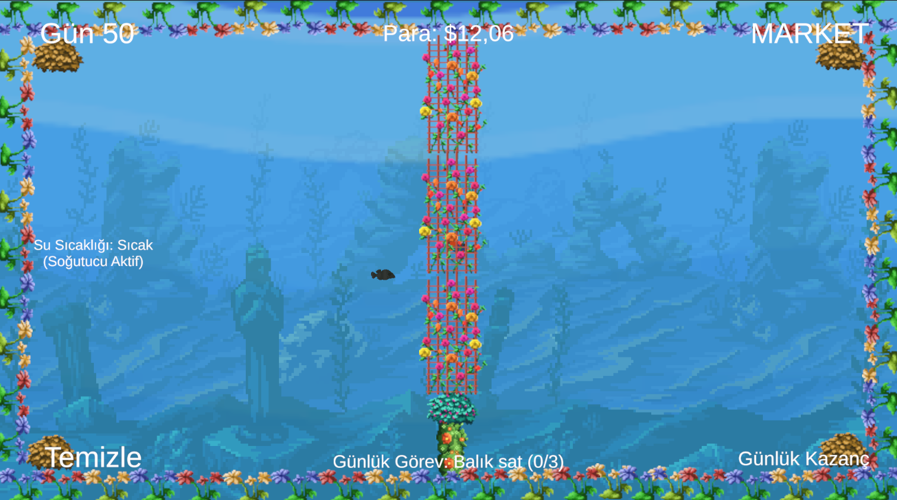

# Aquarium Tycoon Simulator

**Aquarium Tycoon Simulator** is a pixel-art aquarium simulation game where you manage fish, accessories, water quality, temperature, and daily business tasks. Balance the ecosystem, earn money, and keep your aquarium thriving day by day.

---

## Core Features

- Daily system with persistent saving
- Buy fish, equipment, accessories, and upgrades
- Temperature effects (cold / hot days)
- Dirt accumulation that affects fish health & growth
- Feed, sell, and observe fish behavior
- Complete daily missions to earn money
- Restart the game at any time with a starter pack
- Auto-save & load system

---

## System Mechanics

| Feature              | Description                                                                 |
|----------------------|-----------------------------------------------------------------------------|
| Temperature        | Cold and hot days randomly affect fish growth. Use heaters/coolers to stabilize |
| Dirt               | Aquarium gets dirty over time and slows down fish growth                    |
| Hunger             | Fish get hungry daily, reducing their growth. Feed them manually or automate it |
| Auto Feeder        | Slows down hunger rate of fish                                              |
| Filter System      | Slows down aquarium dirt accumulation                                       |
| Daily Discount     | One random fish is discounted each day in the market                       |
| Save System        | Press `ESC` to save, or restart with `R`                                   |

---

## Fish System

- 33 fish species with different speed, health, and behavior
- Fish grow over time if well-fed, clean, and in optimal temperature
- Fish have different animations: swim, idle, fast swim, death
- Piranhas **attack** other fish but peacefully live with other piranhas

---

## Accessory System

- 80+ accessory items for decoration  
- Place them freely using drag and drop  
- Rotate with `E` before placing  

---

## Mission & Market System

- Daily missions (e.g., "Sell 3 fish", "Feed 2 fish")
- Completing missions rewards you with extra money
- One fish type is randomly discounted every day
- Purchase gear like heaters, coolers, filters, and feeders

---

## Save & Restart

- `ESC`: Save progress instantly  
- `R`: Restart the game with a starter pack  

---

## Screenshots

| Image | Description |
|-------|-------------|
|  | Feeding effect when right-clicking a fish |
|  | Accessory placement with rotation support |
|  | View of the active daily mission system |
|  | Hunger reduces health over time |
|  | Real-time display of selected fish’s stats |
|  | Visual animation when a fish dies |
|  | Starter pack items shown on restart |
|  | Market interface to buy items and fish |
|  | Track your daily profit and earnings |
|  | Discount offer for a fish of the day |
|  | Cold day with icy blue overlay |
|  | Hot day effect with reddish hue |
|  | Heater and cooler upgrades in market |
|  | Equipment that automates feeding and cleaning |
|  | Aquarium becoming visibly dirty |
|  | Piranhas attacking other fish |

---

## Script Reference (C#)

### `GameManager.cs`
Handles the core day-cycle system, including tracking current day, weather events (hot/cold), and triggering environmental effects.

### `AquariumManager.cs`
Controls aquarium state: cleanliness, temperature, accessory placement, and environmental changes like heater/cooler effect.

### `FishMovement.cs`
Handles fish pathfinding, direction flipping, random wandering, and speed variations based on fish type.

### `FishClick.cs`
Detects right-click input on fish, triggering feeding logic and visual effects.

### `FishGrowth.cs`
Calculates and updates fish growth based on feeding, cleanliness, hunger, and environmental factors. Handles death due to poor conditions.

### `FishInfo.cs`
Displays real-time information of selected fish such as species name, growth progress, health, and speed.

### `FishSaveData.cs`
Stores essential fish properties to be saved and loaded later (type, size, health, etc.)

### `DailyMission.cs`
Defines structure and completion criteria for each daily mission (feeding, selling fish).

### `MissionManager.cs`
Generates random missions each day, tracks progress, and handles rewards on completion.

### `DailyStats.cs`
Tracks day-specific data like profit made, number of fish sold/fed, and resets each new day.

### `DiscountManager.cs`
Selects a random fish each day to be discounted in the shop, and updates the UI accordingly.

### `UIManager.cs`
Manages display elements including money, day, aquarium status, temperature, etc.

### `UIMarketManager.cs`
Handles market purchasing interface, buying fish or accessories, applying discounts, and updating UI.

### `AccesoryPlacementManager.cs`
Allows players to place and rotate accessories in the aquarium with interactive placement logic.

### `SaveManager.cs`
Handles saving and loading of all game data using PlayerPrefs and JSON structure.

### `SaveData.cs`
Struct that holds all serialized saveable game data: fish, money, accessories, systems, and day count.

---

## Audio

- Relaxing **background music** plays continuously for an immersive aquatic atmosphere.

---

> **Dive in, manage smart, and create your perfect pixel aquarium!**

---
